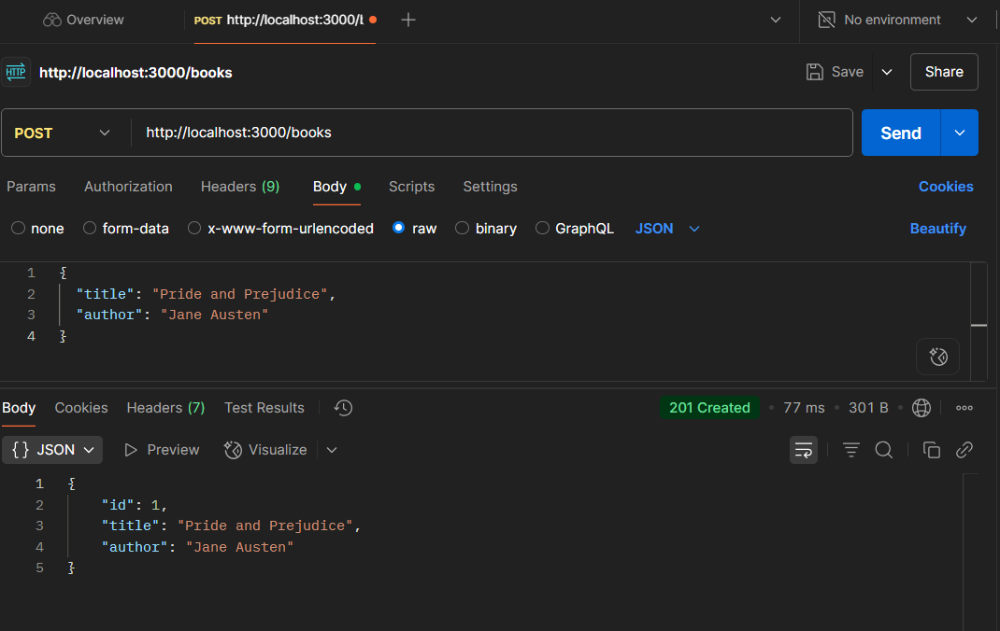
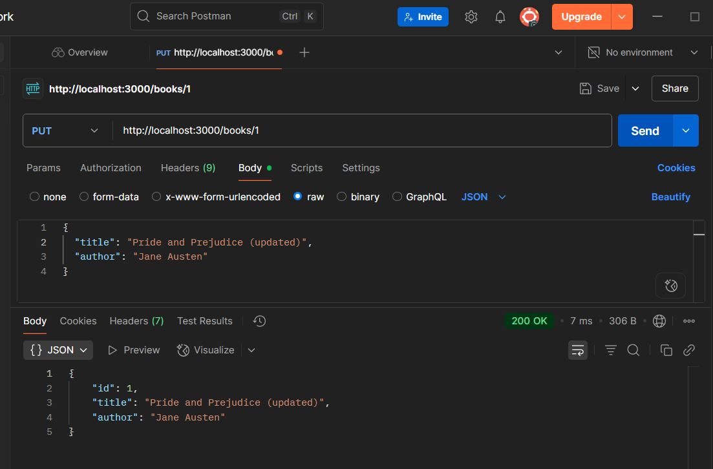
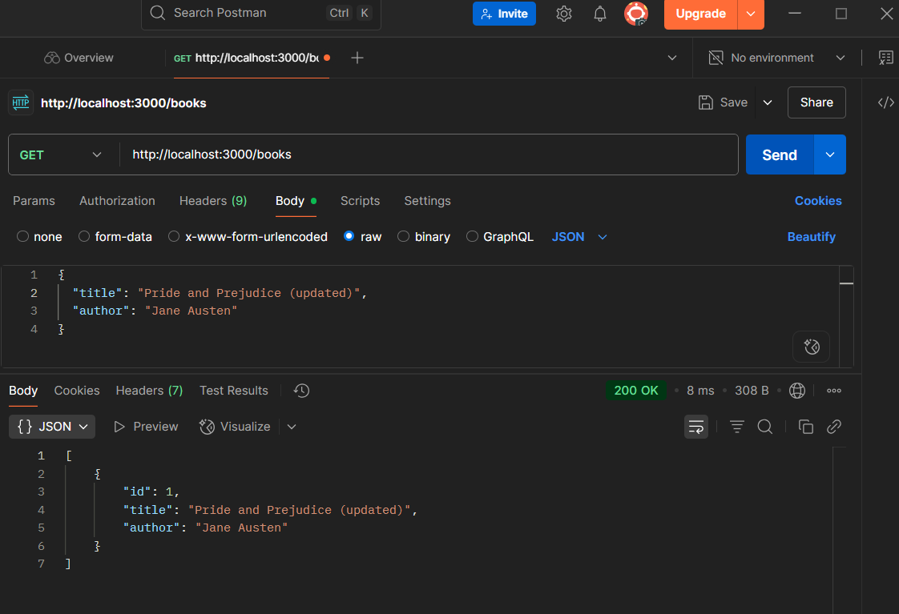
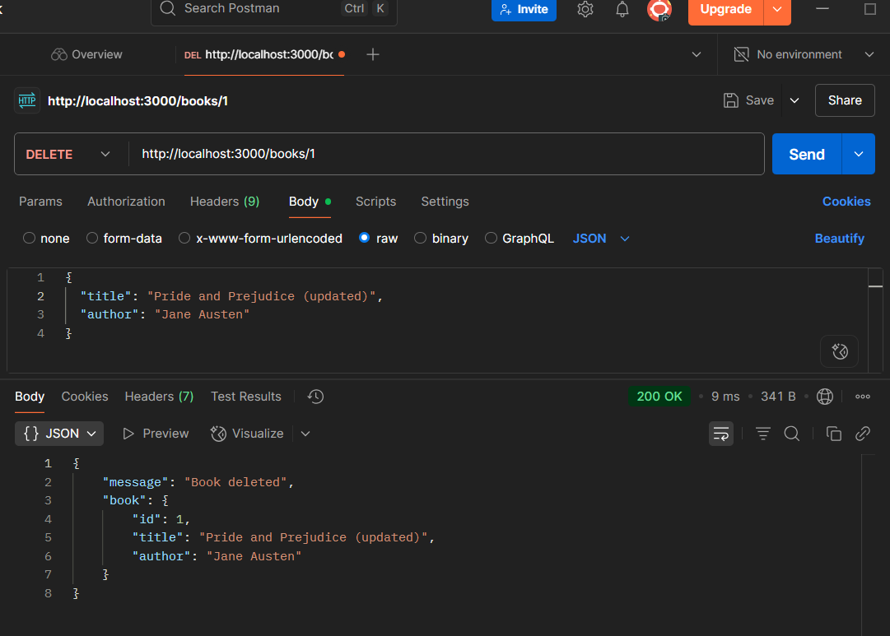
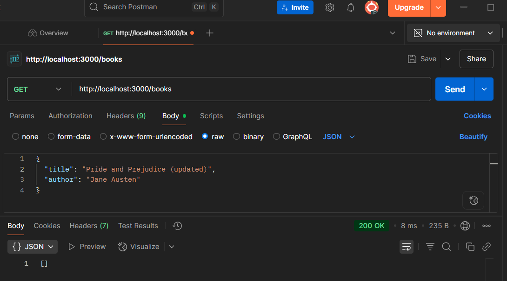

# 📘 Book Management REST API using Node.js and Express

A simple REST API to perform CRUD operations on a list of books. This API uses in-memory storage (no database required) and is tested using Postman.

---

## 🚀 Getting Started

### Prerequisites

- Node.js installed
- Postman for testing API
- Code Editor (VS Code preferred)

### Setup

1. Initialize the project:

    ```bash
    npm init -y
    ```

2. Install dependencies:

    ```bash
    npm i express
    ```

3. Save the code from [`server.js`](server.js) in your project directory.

4. Start the server:

    ```bash
    node server.js
    ```
    or
    ```bash
    nodemon server.js
    ```

    The server will run on `http://localhost:3000`.

---

## 📬 API Endpoints

| Method | Endpoint      | Description               |
|--------|--------------|---------------------------|
| GET    | `/books`     | Get all books             |
| POST   | `/books`     | Add a new book            |
| PUT    | `/books/:id` | Update a book by ID       |
| DELETE | `/books/:id` | Delete a book by ID       |

---

## 🧪 Testing the API with Postman

### 1.  **POST a new book**

- **Request:**  
  - Method: `POST`
  - URL: `http://localhost:3000/books`
  - Body (JSON):
    ```json
    {
     "title": "Pride and Prejudice",
     "author": "Jane Austen"
    }
    ```
- **Response:**  
  Returns the created book object.



--- 


### 2.**GET all books**

- **Request:**  
  - Method: `GET`
  - URL: `http://localhost:3000/books`
- **Response:**  
  Returns an array of all books.


---
### 3. **PUT (Update) a book**

- **Request:**  
  - Method: `PUT`
  - URL: `http://localhost:3000/books/1`
  - Body (JSON):
    ```json
    {
     "title": "Pride and Prejudice (updated)",
     "author": "Jane Austen"
    }
    ```
- **Response:**  
  Returns the updated book object.



- **Verify Update:**  
  Send a `GET` request to `/books` to confirm the update.



---

### 4. **DELETE a book**

- **Request:**  
  - Method: `DELETE`
  - URL: `http://localhost:3000/books/1`
- **Response:**  
  Returns a message confirming deletion.



- **Verify Deletion:**  
  Send a `GET` request to `/books` to confirm the book is removed.



---

## 📝 Notes

- All data is stored in memory. Restarting the server will reset the book list.
- Make sure to set the request body type to `JSON` in Postman for POST and PUT requests.

---

## 📷 Screenshots

- `get.png` – GET all books
- `post.png` – POST a new book
- `put1.png` – PUT (update) a book
- `put2.png` – GET after PUT (verify update)
- `delete1.png` – DELETE a book
- `delete2.png` – GET after DELETE (verify deletion)

---

## node_modules added to .gitignore